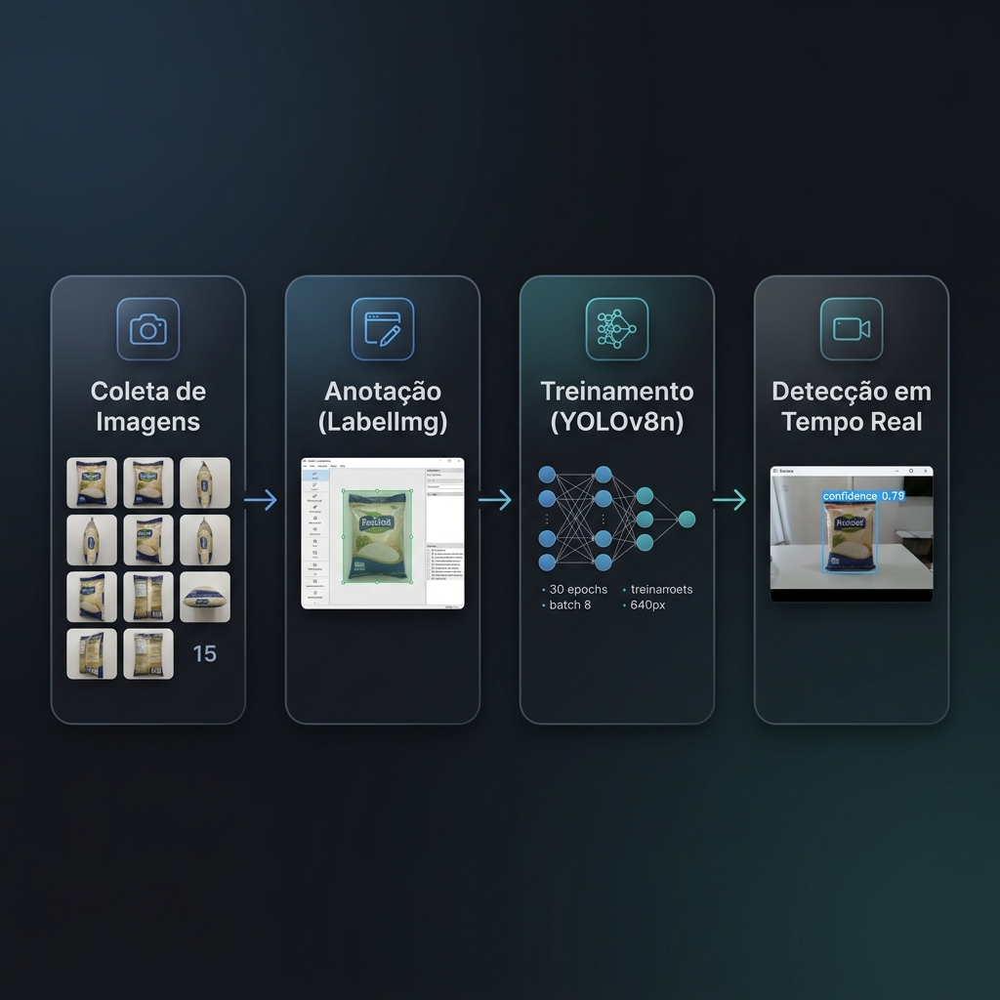
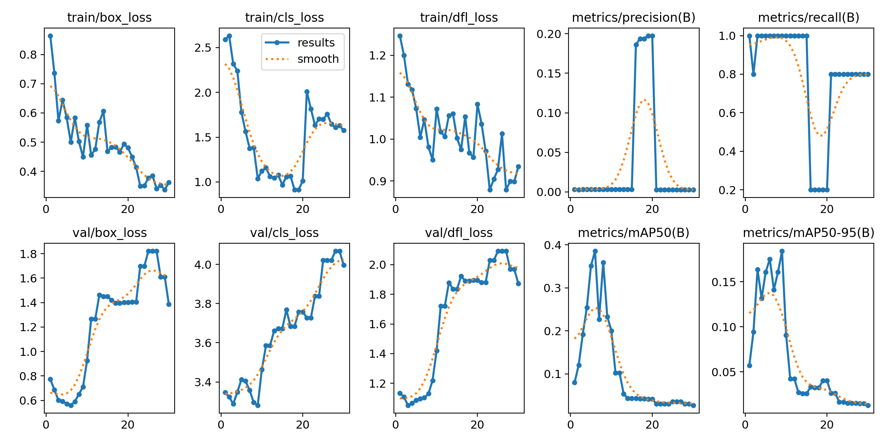
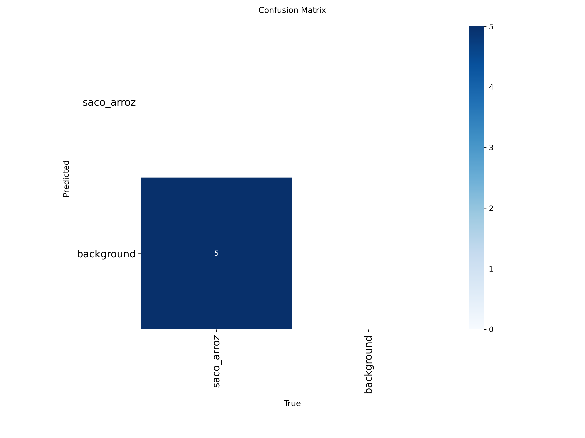
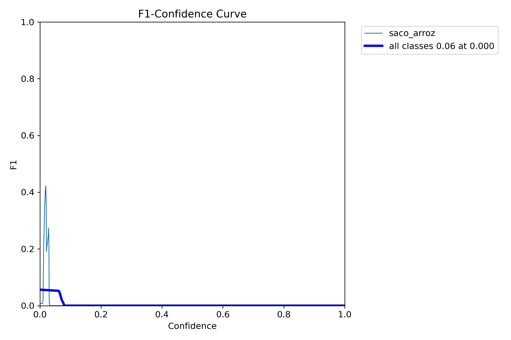
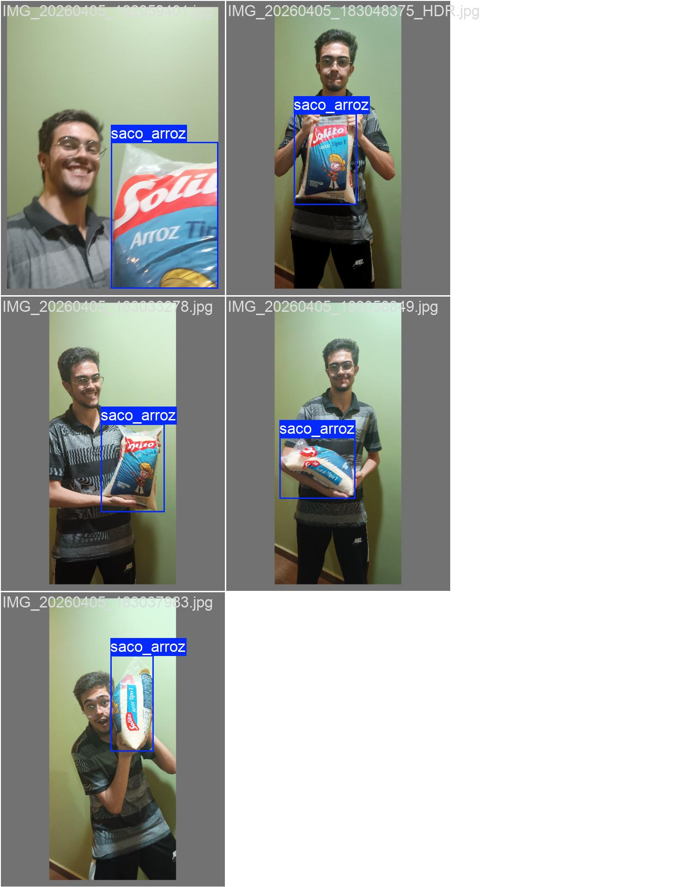
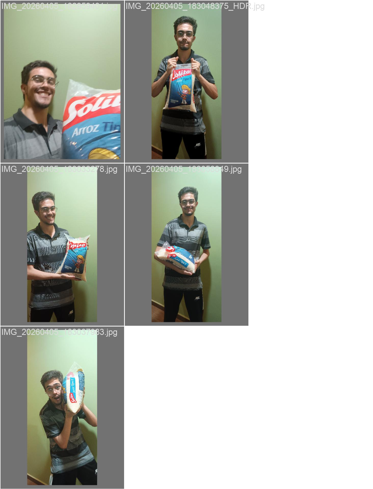

# 🤖 AlimempatIA — Visão Computacional v1

> **Primeira versão** do modelo de detecção de objetos do projeto AlimempatIA.  
> Objetivo: identificar **sacos de arroz** em tempo real usando a câmera do celular.

---

## 📋 Visão Geral

| Item | Detalhe |
|---|---|
| **Modelo base** | YOLOv8n (Nano) — pré-treinado no COCO |
| **Técnica** | Transfer Learning (fine-tuning) |
| **Classe detectada** | `saco_arroz` |
| **Ferramenta de anotação** | LabelImg (formato YOLO/TXT) |
| **Framework** | Ultralytics YOLOv8 + OpenCV |
| **Dispositivo de treino** | CPU |

---

## 🔄 Pipeline de Treinamento



**1. Coleta** → 15 fotos de um saco de arroz em ângulos variados (frente, traseira, lateral, cima, em pé)  
**2. Anotação** → Bounding boxes desenhadas no LabelImg, gerando arquivos `.txt` no formato YOLO  
**3. Treinamento** → Fine-tuning do YOLOv8n por 30 épocas  
**4. Inferência** → Detecção em tempo real via câmera do celular (DroidCam)

---

## 📁 Estrutura do Dataset

```
dataset/
├── dataset.yaml          # Configuração de classes e caminhos
├── images/
│   ├── train/            # 15 imagens de treino
│   └── val/              # 5 imagens de validação
└── labels/
    ├── train/            # 13 anotações (.txt) — formato YOLO
    └── val/              # 5 anotações (.txt) — formato YOLO
```

### Formato das Anotações (YOLO)

Cada arquivo `.txt` contém uma linha por objeto detectado:

```
<classe> <x_centro> <y_centro> <largura> <altura>
```

**Exemplo** (`Frente.txt`):
```
0 0.408701 0.500545 0.607108 0.927015
```

> Todos os valores são **normalizados** (0 a 1) em relação ao tamanho da imagem.  
> `0` = índice da classe `saco_arroz`.

---

## ⚙️ Hiperparâmetros do Treinamento

| Parâmetro | Valor | Descrição |
|---|---|---|
| `epochs` | 30 | Passagens completas pelo dataset |
| `imgsz` | 640 | Resolução de entrada (px) |
| `batch` | 8 | Imagens processadas por iteração |
| `device` | CPU | Sem GPU dedicada |
| `model` | `yolov8n.pt` | Modelo Nano (6,5 MB) |
| `optimizer` | auto | SGD com momentum 0.937 |
| `lr0` | 0.01 | Taxa de aprendizado inicial |
| `mosaic` | 1.0 | Data augmentation com mosaico |

---

## 📊 Resultados do Treinamento (train5)

### Métricas Finais (Época 30)

| Métrica | Valor |
|---|---|
| **mAP@50** | 0.027 (2.7%) |
| **mAP@50-95** | 0.013 (1.3%) |
| **Precision** | 0.003 |
| **Recall** | 0.80 |
| **Train Box Loss** | 0.362 |
| **Train Cls Loss** | 1.574 |

### Evolução do Treinamento

O gráfico abaixo mostra a evolução das losses e métricas ao longo das 30 épocas:



### Matriz de Confusão

A matriz abaixo mostra que o modelo **classificou todas as 5 imagens de validação como background**, não conseguindo detectar corretamente o objeto `saco_arroz`:



### Curva F1-Confiança

O F1-score máximo atingido foi de apenas **0.06**, em um limiar de confiança próximo de 0:



### Predições na Validação

| Ground Truth (esperado) | Predição do Modelo |
|---|---|
|  |  |

> O modelo conseguiu localizar os objetos nas imagens de validação, porém com **confiança muito baixa** — insuficiente para ser útil em produção.

---

## 🔍 Análise Crítica — Por que os resultados são baixos?

Esta é uma versão **v1 experimental**. Os resultados fracos são **esperados** e decorrem de:

| Causa | Impacto |
|---|---|
| **Dataset minúsculo** (15 treino + 5 validação) | O modelo não tem exemplos suficientes para generalizar |
| **Apenas 1 classe** com pouca variação | Dificulta a distinção entre objeto e fundo |
| **2 imagens sem anotação** (`Cima1.jpg`, `Cima2.jpg`) | Confundem o modelo durante o treino (imagem sem label = "sem objetos") |
| **Treinamento em CPU** | Mais lento, porém não afeta a qualidade final |
| **Overfitting** | Val losses sobem enquanto train losses caem → o modelo decorou o treino |

---

## 🚀 Próximos Passos (v2)

- [ ] Expandir o dataset para **100+ imagens** com variação de fundo, iluminação e escala
- [ ] Corrigir as 2 imagens sem anotação (`Cima1.jpg`, `Cima2.jpg`)
- [ ] Adicionar mais classes de alimentos (ex: `saco_feijao`, `lata_oleo`)
- [ ] Testar com GPU para treinos mais longos (100+ épocas)
- [ ] Implementar data augmentation mais agressivo (rotação, blur, recorte)
- [ ] Integrar o modelo ao backend da aplicação

---

## 🛠️ Como Executar

### Pré-requisitos
```bash
pip install ultralytics opencv-python
```

### Treinar o modelo
```bash
python treinar.py
```

### Testar com câmera (DroidCam)
```bash
python teste.py
```

> ⚠️ Atualize o IP do DroidCam em `teste.py` (linha 13) e o caminho do `best.pt` (linha 7) antes de executar.

---

## 📂 Arquivos Principais

| Arquivo | Função |
|---|---|
| `treinar.py` | Script de fine-tuning do YOLOv8n |
| `teste.py` | Inferência em tempo real via câmera |
| `dataset/dataset.yaml` | Configuração do dataset (classes e caminhos) |
| `yolov8n.pt` | Pesos pré-treinados do modelo base |
| `runs/detect/train5/` | Resultados do 5º treinamento (métricas, gráficos, pesos) |
