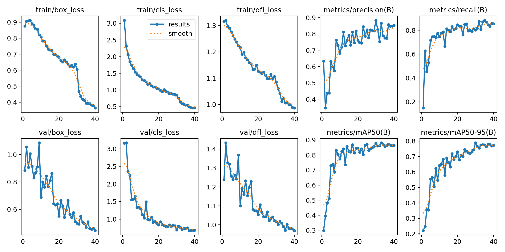
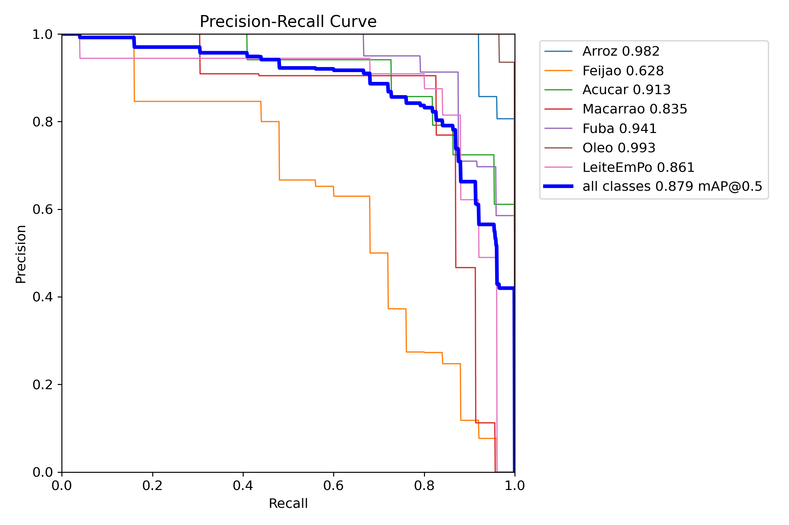
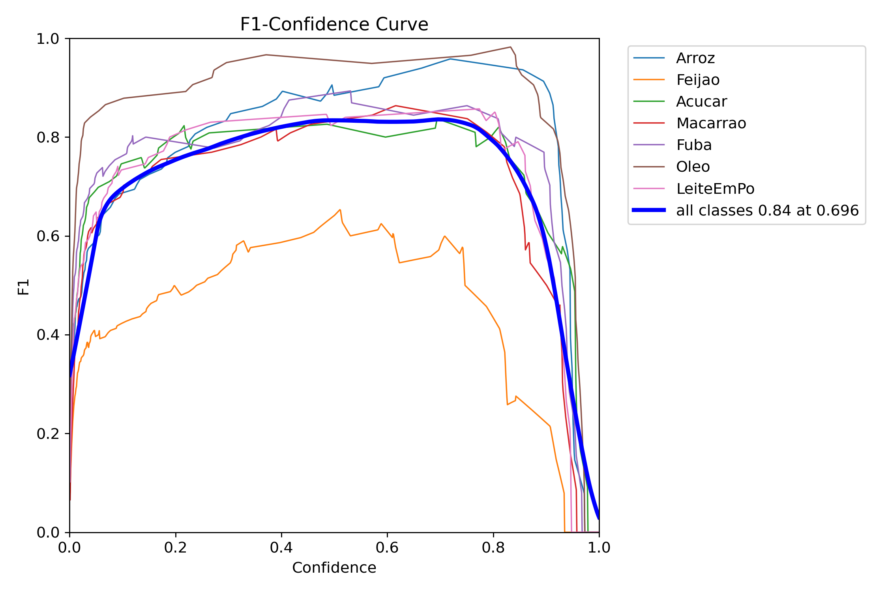
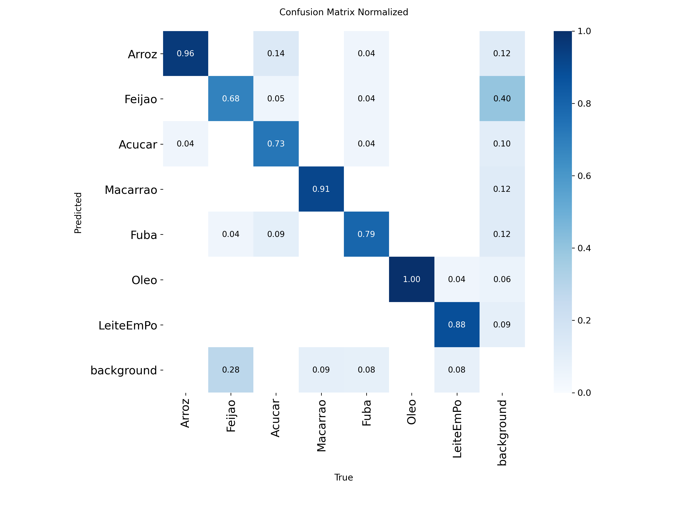
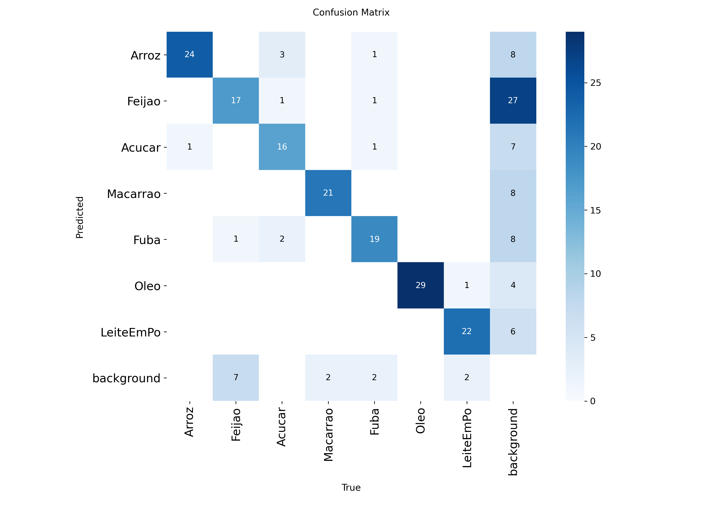
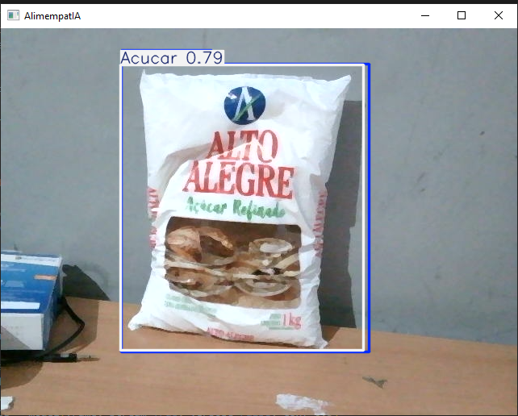
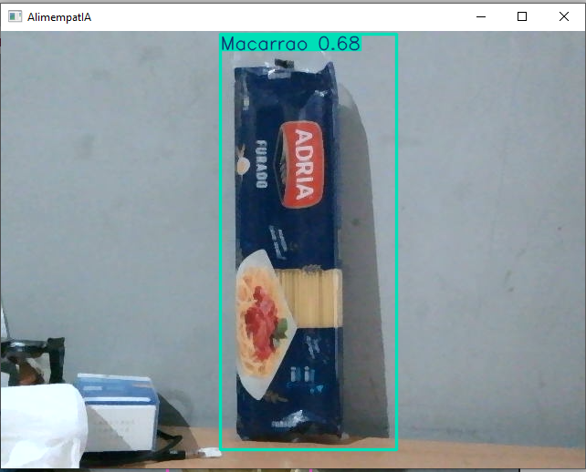
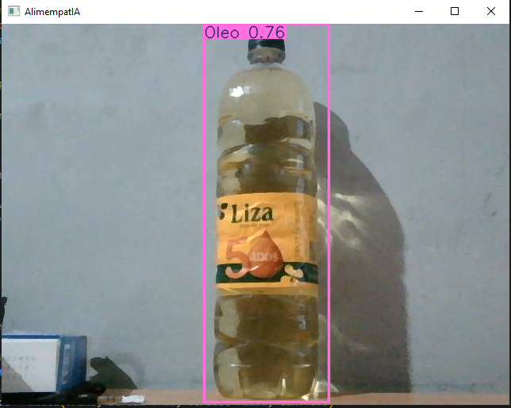

# Relatorio de Eficiencia do Modelo AlimempatIA -- Versao 2

## Integrantes do Grupo
- Bernardo Seijas Cavalcante - 24026290
- Eduardo Chen Zou - 24025817
- Fabiano Henrique Chou - 24025991
- Nicolas Roberto Jordan Morales - 24025897

## 1. Introducao

Este relatorio apresenta uma analise da eficiencia do modelo de deteccao de objetos **AlimempatIA**, desenvolvido para identificar produtos alimenticios da cesta basica em tempo real. O modelo foi treinado utilizando a arquitetura **YOLOv8n** (variante Nano), otimizada para inferencia rapida em dispositivos com recursos limitados. Os resultados aqui descritos referem-se ao treinamento da **versao 2 (v2)** do modelo, denominada internamente de `train_slim`.

As classes detectadas pelo modelo sao:

| Indice | Classe       |
|--------|------------- |
| 0      | Arroz        |
| 1      | Feijao       |
| 2      | Acucar       |
| 3      | Macarrao     |
| 4      | Fuba         |
| 5      | Oleo         |
| 6      | LeiteEmPo    |

---

## 2. Configuracao do Treinamento

O treinamento foi conduzido com os seguintes parametros principais:

| Parametro         | Valor            |
|-------------------|------------------|
| Modelo base       | YOLOv8n (Nano)   |
| Epocas            | 40               |
| Tamanho da imagem | 512x512 pixels   |
| Batch size        | 16               |
| Dispositivo       | GPU (device 0)   |
| Otimizador        | Automatico (auto)|
| Learning rate     | 0.01 (inicial)   |
| Peso pre-treinado | Sim (pretrained) |
| Mosaic            | Ativado (1.0)    |
| Augmentacao       | RandAugment      |
| Precisao mista    | Sim (AMP)        |

A utilizacao da variante Nano do YOLOv8 foi uma escolha deliberada visando equilibrar desempenho e velocidade de inferencia, dado que o modelo deve operar em cenarios de deteccao em tempo real via camera.

---

## 3. Evolucao do Treinamento

O grafico abaixo consolida as curvas de perda (loss) de treinamento e validacao, alem das metricas de precisao, recall e mAP ao longo das 40 epocas:

### 3.1. Perdas de Treinamento

As tres funcoes de perda monitoradas durante o treinamento (box_loss, cls_loss e dfl_loss) apresentaram queda consistente ao longo das epocas:

- **Box Loss (perda de localizacao):** Reduziu de 0.875 na epoca 1 para 0.364 na epoca 40, indicando que o modelo aprimorou significativamente sua capacidade de localizar os objetos nas imagens.
- **Classification Loss (perda de classificacao):** Apresentou a maior reducao proporcional, caindo de 3.091 para 0.468. Isso demonstra que o modelo aprendeu efetivamente a distinguir entre as sete classes de alimentos.
- **DFL Loss (perda de distribuicao focal):** Reduziu de 1.316 para 0.987, mostrando melhora na precisao das bordas das caixas delimitadoras.

### 3.2. Perdas de Validacao

As perdas de validacao acompanharam a tendencia de queda das perdas de treinamento, o que indica ausencia de overfitting significativo:

- **Val Box Loss:** De 0.884 para 0.445.
- **Val Cls Loss:** De 3.161 para 0.686.
- **Val DFL Loss:** De 1.238 para 0.970.

A aproximacao entre as curvas de treinamento e validacao sugere que o modelo generalizou adequadamente para dados nao vistos durante o treino.

---

## 4. Metricas Finais de Desempenho

Ao final das 40 epocas de treinamento, o modelo atingiu as seguintes metricas globais:

| Metrica           | Valor Final |
|-------------------|-------------|
| Precision         | 85.19%      |
| Recall            | 85.45%      |
| mAP@0.5           | 86.26%      |
| mAP@0.5:0.95      | 77.26%      |

Estes valores sao considerados satisfatorios para um modelo da categoria Nano, que prioriza velocidade sobre acuracia maxima. O mAP@0.5 de 86.26% indica que, em media, o modelo identifica corretamente os produtos alimenticios em mais de 86% das vezes quando considerado um limiar de IoU de 50%.

O mAP@0.5:0.95 de 77.26% revela que, mesmo sob criterios mais rigorosos de sobreposicao entre a caixa predita e a caixa real, o modelo mantem um desempenho robusto.

---

## 5. Analise por Classe

### 5.1. Curva Precision-Recall

A curva Precision-Recall abaixo detalha o desempenho individual de cada classe:

Os valores de AP (Average Precision) por classe, extraidos da curva, sao:

| Classe     | AP@0.5  |
|------------|---------|
| Arroz      | 98.2%   |
| Feijao     | 62.8%   |
| Acucar     | 91.3%   |
| Macarrao   | 83.5%   |
| Fuba       | 94.1%   |
| Oleo       | 99.3%   |
| LeiteEmPo  | 86.1%   |
| **Media**  | **87.9%** |

**Apontamentos:**

- **Oleo** e **Arroz** foram as classes com melhor desempenho, atingindo AP superiores a 98%. Isso pode ser atribuido as caracteristicas visuais distintas dessas embalagens (formato de garrafa para o oleo e pacote padronizado para o arroz), que facilitam a deteccao.
- **Feijao** apresentou o menor AP (62.8%), o que representa o principal ponto de atencao do modelo. A queda de desempenho nessa classe pode estar relacionada a similaridade visual entre embalagens de feijao e outros produtos, ou a uma menor representatividade dessa classe no conjunto de dados de treinamento. Conforme a matriz de confusao normalizada, 28% das amostras reais de feijao foram classificadas como background, indicando falhas na deteccao.
- **Fuba** alcancou um AP elevado de 94.1%, porem a matriz de confusao indica pequenas confusoes com feijao (4%) e acucar (9%), possivelmente devido a semelhancas nas cores das embalagens.

### 5.2. Curva F1-Confidence

A curva F1 em funcao do limiar de confianca revela o ponto de equilibrio ideal entre precisao e recall:

O F1-Score maximo medio foi de **0.84**, alcancado em um limiar de confianca de **0.696**. Isso significa que, ao configurar o modelo para reportar apenas deteccoes com confianca superior a aproximadamente 70%, obtem-se o melhor balanco entre falsos positivos e falsos negativos.

Destaca-se que a classe **Oleo** mantem um F1-Score acima de 0.90 em uma ampla faixa de confianca (de 0.2 a 0.9), o que confirma a robustez da deteccao dessa classe. Ja a classe **Feijao** apresenta valores de F1 consideravelmente mais baixos ao longo de toda a curva, reafirmando a necessidade de melhoria no treinamento para essa categoria.

---

## 6. Matriz de Confusao

A matriz de confusao normalizada permite avaliar onde o modelo acerta e onde comete erros sistematicos:

A matriz de confusao em valores absolutos complementa a analise:

**Apontamentos sobre a matriz de confusao:**

- **Oleo** obteve 100% de acerto na diagonal principal, sem qualquer confusao com outras classes. Este e o melhor resultado individual do modelo.
- **Arroz** apresentou 96% de acerto, com uma pequena confusao de 14% oriunda de amostras de Acucar erroneamente classificadas como Arroz. Essa confusao pode ser explicada pela semelhanca das embalagens brancas de ambos os produtos.
- **Macarrao** atingiu 91% de acerto na classificacao, demonstrando boa capacidade de discriminacao.
- **LeiteEmPo** alcancou 88% de acerto, com 9% de falsos positivos provenientes do background. Isso indica que, em alguns casos, elementos do fundo da imagem sao erroneamente detectados como LeiteEmPo.
- **Fuba** obteve 79% de acerto, com confusoes menores oriundas de Feijao (4%) e Acucar (9%).
- **Acucar** registrou 73% de acerto, com 10% de falsos positivos do background e confusao com Fuba (4%).
- **Feijao** foi a classe com maior taxa de erro: apenas 68% de acerto, com 28% das amostras sendo classificadas como background (nao detectadas) e 40% dos falsos positivos vindo do background. Esse resultado reforca que a classe Feijao necessita de maior volume de dados de treinamento ou maior diversidade de amostras.

---

## 7. Deteccoes em Imagens Reais

As imagens a seguir demonstram o modelo em funcionamento sobre capturas reais de camera, validando seu desempenho pratico em cenarios do mundo real.

### 7.1. Deteccao de Acucar

O modelo identificou corretamente uma embalagem de acucar da marca Alto Alegre com confianca de 79%. A caixa delimitadora abrangeu adequadamente toda a extensao do produto, demonstrando boa localizacao espacial.

### 7.2. Deteccao de Macarrao

O macarrao da marca Adria foi detectado com confianca de 68%. Embora o valor de confianca seja moderado, a deteccao foi correta tanto na classificacao quanto na localizacao. A confianca ligeiramente inferior pode ser explicada pela iluminacao lateral e pelo fundo parcialmente escuro da imagem.

### 7.3. Deteccao de Oleo

O oleo de soja da marca Liza foi identificado com 76% de confianca. A caixa delimitadora enquadrou corretamente a garrafa, apesar da presenca de sombra e reflexos na embalagem transparente, que podem dificultar a deteccao.

---

## 8. Consideracoes Finais

O modelo AlimempatIA v2, baseado na arquitetura YOLOv8n, demonstrou eficiencia satisfatoria na deteccao de 7 classes de produtos alimenticios da cesta basica. Com um mAP@0.5 de 87.9% e mAP@0.5:0.95 de 77.26%, o modelo apresenta um bom equilibrio entre acuracia e velocidade de inferencia.

Os principais pontos de destaque sao:

1. **Classes com alto desempenho:** Oleo (99.3% AP), Arroz (98.2% AP) e Fuba (94.1% AP) foram consistentemente bem detectados, com baixissimas taxas de confusao.

2. **Classe com desempenho insuficiente:** Feijao (62.8% AP) e a classe que mais compromete a media geral do modelo. A alta taxa de classificacao como background (28%) sugere que o modelo nao esta conseguindo detectar essa classe com confiabilidade. Recomenda-se aumentar o volume e a variedade de imagens de feijao no dataset de treinamento.

3. **Convergencia adequada:** As curvas de perda de treinamento e validacao seguiram trajetorias similares, sem indicios de overfitting, o que valida a generalizacao do modelo.

4. **Aplicabilidade pratica:** As deteccoes em imagens reais confirmaram que o modelo consegue operar em condicoes de iluminacao e fundo variados, embora com niveis de confianca moderados (entre 68% e 79% nos exemplos avaliados).

Como proximos passos para aprimoramento do modelo, sugere-se:

- Ampliar o dataset de treinamento para a classe Feijao, incluindo imagens reais com diferentes marcas, angulos e condicoes de iluminacao.
- Avaliar tecnicas de aumento de dados (data augmentation) direcionadas para as classes com menor desempenho.
- Considerar o treinamento hibrido com imagens sinteticas e reais para reduzir o gap de dominio entre o dataset de treino e o cenario de uso real.
